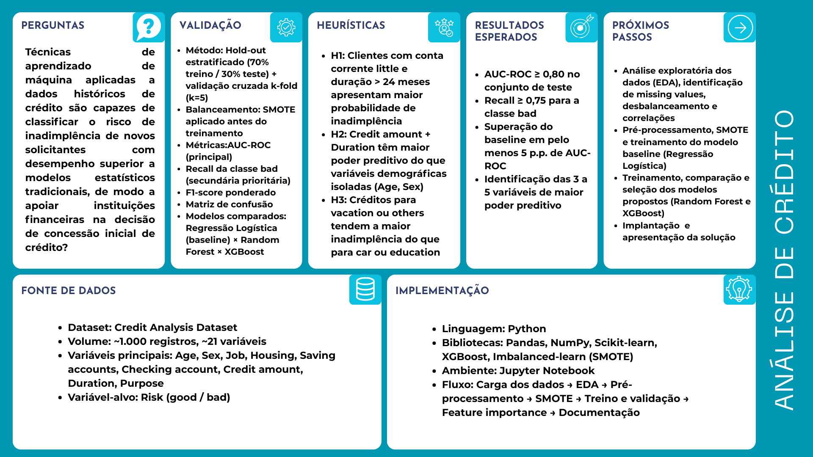

# Introdução

O acesso ao crédito desempenha papel central na economia moderna, viabilizando operações financeiras de curto e longo prazo para pessoas físicas e jurídicas. Entretanto, a concessão de crédito envolve riscos relevantes para as instituições financeiras, sendo a inadimplência um dos principais. A inadimplência ocorre quando um devedor deixa de cumprir suas obrigações dentro do prazo estabelecido, gerando impactos negativos para os credores e para o sistema econômico como um todo.

A análise de risco de inadimplência é atividade essencial no processo decisório das instituições que oferecem crédito. Historicamente realizada com base em regras de negócio e avaliação manual de especialistas, essa análise passou a incorporar, com o avanço tecnológico, ferramentas capazes de identificar padrões em dados históricos dos clientes, permitindo estimar probabilidades de inadimplência de forma mais precisa.

Este projeto tem como foco o desenvolvimento e a avaliação de um modelo preditivo voltado à classificação de risco de crédito no momento da concessão inicial, utilizando dados do perfil financeiro e demográfico de clientes. O recorte escolhido é justificado pela disponibilidade de dados estruturados no dataset selecionado e pela relevância prática do problema: apoiar a decisão de conceder ou não crédito a um novo solicitante, com base em características previamente observadas.

O projeto se justifica pela relevância do tema no cenário econômico atual e pela oportunidade de explorar técnicas de ciência de dados em um problema com impacto direto na redução de perdas financeiras por inadimplência. O público-alvo inclui profissionais e organizações que atuam em instituições que oferecem serviços de crédito, como bancos, fintechs e cooperativas financeiras.

## Problema

A concessão de crédito é atividade fundamental para instituições financeiras, bancos e empresas que ofertam crédito, mas envolve riscos significativos relacionados à incapacidade de pagamento dos clientes. Muitos processos de análise de crédito ainda são baseados em critérios rígidos, avaliações manuais ou regras simplificadas, o que limita a capacidade de identificar padrões complexos de risco. Essa limitação pode resultar tanto na concessão de crédito a clientes com alta probabilidade de inadimplência quanto na recusa injustificada a clientes confiáveis.

Entre os principais desafios enfrentados pelas instituições, destacam-se:

- **Dificuldade na identificação precisa do risco:** a análise baseada em poucos indicadores financeiros pode não capturar padrões presentes no comportamento financeiro dos clientes. Variáveis como histórico de pagamento, renda, tempo de emprego, valor e finalidade do crédito influenciam diretamente na probabilidade de inadimplência, mas nem sempre são analisadas de forma integrada e sistemática.
- **Volume crescente de dados:** com a digitalização dos serviços financeiros, as instituições passaram a lidar com grandes volumes de dados de clientes. Sem ferramentas analíticas adequadas, é difícil transformar esses dados em informações estratégicas para a decisão de crédito.
- **Risco financeiro de decisões imprecisas:** erros na análise de crédito geram prejuízos relevantes. Segundo o Banco Central do Brasil, a taxa de inadimplência no Sistema Financeiro Nacional, considerando atrasos superiores a 90 dias, permanece próxima de 4% da carteira total de crédito, representando bilhões de reais em exposição ao risco.

Nesse cenário, torna-se evidente a necessidade de soluções baseadas em análise de dados que permitam identificar padrões de comportamento financeiro e prever a probabilidade de inadimplência com maior precisão e de forma reprodutível.

## Questão de pesquisa

Diante do cenário apresentado, a presente pesquisa busca responder à seguinte questão:

 "Técnicas de aprendizado de máquina aplicadas a dados históricos de crédito são capazes de classificar o risco de inadimplência de novos solicitantes com desempenho superior a modelos estatísticos tradicionais, de modo a apoiar instituições financeiras na tomada de decisão de concessão inicial de crédito?"

Essa questão delimita o problema em torno da classificação binária de risco (bom pagador / mau pagador) no momento da solicitação, orientando a escolha dos algoritmos, das métricas de avaliação e dos critérios de sucesso do projeto.

## Objetivos preliminares

### Objetivo Geral

Desenvolver e avaliar um modelo preditivo de classificação de risco de crédito baseado em técnicas de aprendizado de máquina, utilizando o Credit Analysis Dataset (Kaggle), com o objetivo de apoiar instituições financeiras na tomada de decisão sobre concessão inicial de crédito.

### Objetivos Específicos

- Realizar seleção crítica e diagnóstico exploratório inicial do dataset, identificando variáveis relevantes, distribuição das classes, valores ausentes e possíveis inconsistências nos dados.
- Mapear e comparar as abordagens da literatura recente sobre classificação de risco de crédito, identificando algoritmos, métricas e resultados que sirvam de referência para o projeto.
- Aplicar técnicas de pré-processamento de dados, incluindo limpeza, codificação de variáveis categóricas, tratamento de valores ausentes e balanceamento de classes.
- Desenvolver e treinar modelos de classificação supervisionada — incluindo ao menos um modelo baseline (Regressão Logística) e modelos candidatos (Random Forest, Gradient Boosting / XGBoost) — avaliando-os por AUC-ROC, Recall e F1-score.
- Analisar a importância das variáveis do dataset para compreender quais fatores possuem maior influência na previsão do risco de crédito.
- Discutir aspectos éticos, de privacidade e de viés algorítmico associados ao uso de dados financeiros e demográficos em modelos de classificação de crédito.

## Justificativa

A inadimplência representa um dos principais riscos operacionais para instituições financeiras. Dados do Banco Central do Brasil (2026) indicam que a taxa de inadimplência no Sistema Financeiro Nacional permanece próxima de 4% da carteira total de crédito em operações com atraso superior a 90 dias — um indicador que evidencia a escala do problema e a necessidade de ferramentas analíticas mais precisas.

O crescimento do volume de dados disponíveis no setor financeiro impulsionou o uso de ciência de dados e aprendizado de máquina para avaliação de risco de crédito. A literatura recente demonstra que modelos baseados em algoritmos de classificação supervisionada — como XGBoost, Random Forest e redes neurais — superam abordagens estatísticas tradicionais em cenários com dados complexos e desbalanceados (KONATHAM et al., 2025; CHANG et al., 2024; SHI et al., 2022).

O uso do Credit Analysis Dataset, disponibilizado publicamente na plataforma Kaggle, possibilita explorar variáveis financeiras e demográficas representativas do perfil de solicitantes de crédito, permitindo o desenvolvimento de um modelo reprodutível e avaliável com métricas objetivas. A disponibilidade pública dos dados também favorece a discussão sobre transparência e responsabilidade no uso de algoritmos em decisões de crédito.

Assim, o projeto contribui tanto para o desenvolvimento de competências técnicas em ciência de dados quanto para a reflexão crítica sobre o uso responsável de modelos preditivos em contextos de alto impacto social e financeiro.

## Público-Alvo

O principal público-alvo são analistas de crédito, gestores financeiros e equipes de ciência de dados em instituições financeiras, bancos, fintechs e cooperativas que necessitam avaliar o risco associado à concessão de crédito. Essas organizações lidam com grandes volumes de solicitações e precisam de ferramentas que complementem os métodos tradicionais de análise, tornando o processo mais eficiente e fundamentado em evidências.

## Estado da arte

A análise de risco de crédito por meio de aprendizado de máquina tem sido amplamente estudada nos últimos anos. A seguir apresenta-se um quadro comparativo com os cinco trabalhos selecionados, seguido de uma síntese analítica que conecta os achados da literatura às escolhas metodológicas deste projeto.

### Quadro Comparativo 

| Referência | Ano | Dataset utilizado | Técnicas / Algoritmos | Métricas avaliadas | Principais resultados |
|---|---|---|---|---|---|
| Teles et al. | 2020 | Revisão sistemática com meta-análise de múltiplos datasets financeiros internacionais; variáveis: histórico de crédito, renda, garantias (colateral) e fatores comportamentais | Redes Neurais, SVM, Regressão Logística, Árvores de Decisão, Redes Bayesianas | AUC, ROC Curve, Accuracy | Modelos de ML superam métodos tradicionais; colateral é variável relevante ainda pouco explorada; interpretabilidade permanece limitação central em modelos complexos |
| Shi et al. | 2022 | Revisão sistemática de 76 estudos; datasets públicos de referência (German Credit, Australian Credit, Lending Club) com variáveis financeiras e comportamentais | Revisão comparativa: Regressão Logística, SVM, Random Forest, ANN, CNN, LSTM, ELM | AUC, Accuracy | Deep learning supera ML clássico e métodos estatísticos; métodos ensemble oferecem maior acurácia que modelos individuais; desbalanceamento, inconsistência de dados e falta de transparência são desafios centrais |
| Li, Q. | 2023 | Dados financeiros de clientes com indicadores de capacidade de pagamento; variáveis derivadas por pré-processamento com seleção via AHP | BP Neural Network (multicamada), Backpropagation, seleção de atributos com AHP | Accuracy, erro de previsão | Melhora significativa na precisão; redes neurais capturam relações não lineares com eficácia superior a métodos tradicionais em cenários com grande volume de dados |
| Chang et al. | 2024 | Dataset de cartão de crédito (Kaggle): variáveis como idade, renda, limite de crédito, status de pagamento, histórico transacional; classificação binária *good/bad* | Redes Neurais, Regressão Logística, AdaBoost, XGBoost, LightGBM; comparação sistemática entre modelos | Accuracy, Precision, Recall, F1-score, AUC, MCC | XGBoost superou todos os demais modelos com accuracy de 99,4%; confirmação de que modelos de gradient boosting são superiores em tarefas de classificação de risco de crédito em datasets tabulares |
| Konatham et al. | 2025 | Dados transacionais de bancos digitais: utilização de crédito, relação dívida/renda, comportamento de pagamento; dados com valores faltantes e ruído | Pipeline completo de ML com SMOTE, normalização, engenharia de atributos, validação cruzada K-fold, modelos de classificação supervisionada | Accuracy, AUC, ROC Curve | Alto desempenho preditivo com adaptação contínua; SMOTE melhora significativamente o Recall da classe inadimplente; necessidade de detecção de drift em ambientes dinâmicos; aprendizado contínuo como diferencial |

### Síntese analítica

Os cinco estudos selecionados convergem para conclusões diretamente aplicáveis a este projeto:

**Sobre os algoritmos:** modelos de ensemble baseados em árvores de decisão — especialmente XGBoost e Gradient Boosting — apresentam desempenho consistentemente superior à Regressão Logística em tarefas de classificação de crédito (CHANG et al., 2024; SHI et al., 2022). A revisão de Shi et al. (2022) confirma que métodos ensemble superam modelos individuais, enquanto Chang et al. (2024) demonstram empiricamente que o XGBoost atinge os melhores resultados em datasets tabulares com variáveis financeiras — exatamente o perfil do dataset deste projeto. Esses achados justificam a escolha do XGBoost e do Random Forest como modelos candidatos, com a Regressão Logística como baseline interpretável.

**Sobre o desbalanceamento de classes:** Konatham et al. (2025) demonstram que a aplicação de SMOTE antes do treinamento resulta em ganhos expressivos de Recall para a classe inadimplente — a métrica mais crítica no contexto de concessão de crédito, onde o custo de não identificar um inadimplente é mais alto que o erro inverso. Esse achado fundamenta diretamente a decisão de aplicar SMOTE no pré-processamento deste projeto.

**Sobre métricas:** a AUC-ROC é a métrica dominante nos estudos mais recentes para comparação de modelos de crédito, por ser robusta ao desbalanceamento de classes (SHI et al., 2022; TELES et al., 2020). Chang et al. (2024) complementam com Precision, Recall, F1-score e MCC, reforçando a necessidade de avaliar o equilíbrio entre os tipos de erro. Este projeto adotará AUC-ROC como métrica principal e Recall da classe *bad* como métrica secundária prioritária.

**Sobre interpretabilidade e ética:** Teles et al. (2020) e Shi et al. (2022) apontam a interpretabilidade como limitação central dos modelos complexos. Esse aspecto é especialmente relevante em crédito: decisões automatizadas que afetam solicitantes exigem transparência e auditabilidade. Este projeto incorporará análise de importância de variáveis (feature importance) como resposta a essa limitação, e discutirá o papel de variáveis demográficas como `Sex` e `Age` no modelo final.

**Sobre variáveis preditivas:** os estudos analisados identificam como variáveis de maior poder preditivo o histórico de pagamento, a situação da conta bancária, o valor e a duração do crédito, e a relação dívida/renda — todas com correspondentes no Credit Analysis Dataset selecionado (`Checking account`, `Saving accounts`, `Credit amount`, `Duration`), validando a adequação do dataset ao problema proposto.

## Ética em Pesquisa, Privacidade e LGPD

O uso de dados financeiros e demográficos em modelos preditivos de crédito envolve dimensões éticas e legais que precisam ser tratadas de forma explícita. Esta seção discute os principais aspectos relevantes para o projeto.

### Sensibilidade dos dados e LGPD

Os dados utilizados no projeto — embora de origem pública e anonimizada (Kaggle) — são representativos de informações que, em contextos reais, são classificadas como dados pessoais sensíveis pela Lei Geral de Proteção de Dados Pessoais (Lei nº 13.709/2018 — LGPD). Atributos como situação de conta bancária, nível de poupança, ocupação, renda e histórico de crédito enquadram-se na categoria de dados financeiros, cujo tratamento exige base legal específica, finalidade definida e medidas de segurança adequadas.

Em aplicações reais, instituições que utilizam esse tipo de dado para decisões automatizadas de crédito devem observar:

- A necessidade de consentimento explícito ou base legal legítima para coleta e uso dos dados;
- O direito do titular de acessar, corrigir e contestar decisões automatizadas que o afetem (art. 20 da LGPD);
- A obrigação de transparência sobre os critérios utilizados na tomada de decisão.

No contexto deste projeto acadêmico, os dados são utilizados exclusivamente para fins educacionais e de pesquisa, sem identificação de pessoas reais, o que está em conformidade com os princípios da LGPD e com os termos de uso da plataforma Kaggle.

## Descrição do *dataset* selecionado

### Identificação e origem

O dataset utilizado é denominado Credit Analysis Dataset, disponibilizado publicamente na plataforma Kaggle:

 https://www.kaggle.com/datasets/kapoorshivam/credit-analysis/data

Publicado pelo usuário Shivam Kapoor, o dataset é destinado ao desenvolvimento de modelos de análise de crédito e previsão de inadimplência, disponível para uso educacional e de pesquisa conforme os termos da plataforma Kaggle.

- **Fonte:** Kaggle – Credit Analysis Dataset

### Visão geral

O dataset contém informações do perfil financeiro e comportamental de clientes que solicitaram crédito, com as seguintes características gerais:

- **Número total de registros:** aproximadamente 1.000 observações
- **Número total de atributos:** cerca de 21 variáveis
- **Tipo de problema:** classificação binária (bom pagador / mau pagador)
- **Variável-alvo:** `Risk` (good/bad)
- **Contexto:** análise de risco de crédito para concessão inicial

O diagnóstico exploratório inicial indica a presença de valores ausentes nas variáveis `Saving accounts` e `Checking account`, que deverão ser tratados na etapa de pré-processamento. A distribuição das classes na variável-alvo (`Risk`) precisará ser avaliada para identificar o grau de desbalanceamento e definir a estratégia de balanceamento mais adequada.

### Atributos do dataset

| Atributo | Descrição | Tipo | Exemplos de valores |
|---|---|---|---|
| Age | Idade do cliente | Numérico | 22, 35, 54 |
| Sex | Gênero do cliente | Categórico | male, female |
| Job | Tipo de ocupação / nível de qualificação | Categórico | 0, 1, 2, 3 |
| Housing | Situação de moradia | Categórico | own, rent, free |
| Saving accounts | Nível da conta poupança | Categórico | little, moderate, rich |
| Checking account | Situação da conta corrente | Categórico | little, moderate, rich |
| Credit amount | Valor do crédito solicitado (moeda) | Numérico | 1000, 5000, 12000 |
| Duration | Duração do crédito (meses) | Numérico | 12, 24, 36 |
| Purpose | Finalidade do crédito | Categórico | car, furniture, education, vacation |
| Risk | Classificação do risco de crédito (variável-alvo) | Categórico | good, bad |

# Canvas analítico

---

# Vídeo de apresentação da Etapa 01

https://drive.google.com/file/d/1czhSkPfzC83ACdspAPieiK8OO6bMxLCH/view?usp=sharing

---

# Referências

BANCO CENTRAL DO BRASIL. **Estatísticas monetárias e de crédito**. Brasília: Banco Central do Brasil, 2026. Disponível em: https://www.bcb.gov.br/content/estatisticas/hist_estatisticasmonetariascredito/202601_Texto_de_estatisticas_monetarias_e_de_credito.pdf. Acesso em: 8 mar. 2026.

BANCO CENTRAL DO BRASIL. **Taxa de inadimplência do crédito no Sistema Financeiro Nacional**. Disponível em: https://www.bcb.gov.br/estatisticas/txinadimplencia.

BRASIL. **Lei nº 13.709, de 14 de agosto de 2018 — Lei Geral de Proteção de Dados Pessoais (LGPD)**. Brasília: Presidência da República, 2018. Disponível em: https://www.planalto.gov.br/ccivil_03/_ato2015-2018/2018/lei/l13709.htm.

CHANG, Victor; SIVAKULASINGAM, Sharuga; WANG, Hai; WONG, Siu Tung; GANATRA, Meghana Ashok; LUO, Jiabin. Credit Risk Prediction Using Machine Learning and Deep Learning: A Study on Credit Card Customers. **Risks**, MDPI, v. 12, n. 11, art. 174, nov. 2024. DOI: 10.3390/risks12110174.

KAGGLE. **Credit Analysis Dataset**. Dataset publicado por Shivam Kapoor. Disponível em: https://www.kaggle.com/datasets/kapoorshivam/credit-analysis/data.

KONATHAM, Mahesh Reddy et al. Optimizing Credit Risk Assessment in Digital Banking Through AI-Driven Predictive Science. In: **IEEE International Conference on Advanced Computing Technologies (ICACT)**, 2025.

LI, Qinghua. Research on Bank Credit Risk Assessment Based on BP Neural Network. In: **International Conference on 3D Immersion, Interaction and Multi-sensory Experiences (ICDIIME)**, 2023.

SHI, Si; TSE, Rita; LUO, Wuman; D'ADDONA, Stefano; PAU, Giovanni. Machine learning-driven credit risk: a systemic review. **Neural Computing and Applications**, v. 34, n. 17, p. 14327–14339, set. 2022. DOI: 10.1007/s00521-022-07472-2.

TELES, Germanno et al. Classification Methods Applied to Credit Scoring With Collateral. **IEEE Systems Journal**, v. 14, n. 3, 2020.
