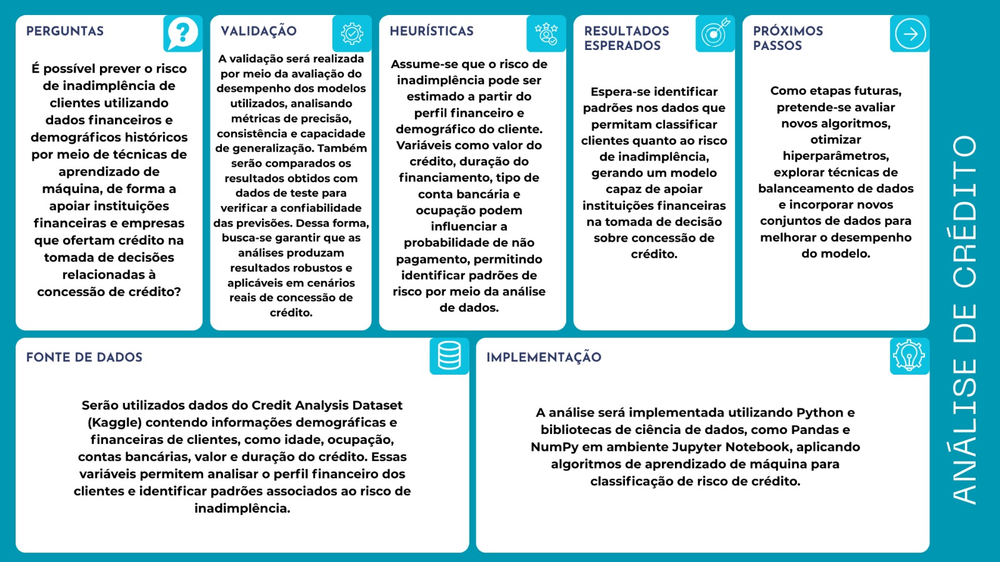

# Introdução

Hoje, o acesso ao crédito tem um grande papel na economia moderna, permitindo que pessoas e organizações realizem operações financeiras de curto e longo prazo. Porém, a concessão desse crédito envolve riscos para as instituições financeiras, sendo um desses riscos a inadimplência. A inadimplência ocorre quando um devedor deixa de cumprir suas obrigações financeiras dentro de um prazo previamente estabelecido, podendo gerar impactos negativos para as instituições credoras e para o sistema econômico.

A análise de risco de inadimplência é uma atividade essencial no processo de tomada de decisão para as instituições financeiras que oferecem crédito. Historicamente, esse tipo de análise era realizada com base em regras de negócio e avaliação manual de especialistas. Porém, com o avanço tecnológico, hoje é possível desenvolver ferramentas que ajudam na identificação de padrões em dados históricos dos devedores, permitindo, assim, estimar a probabilidade de inadimplência de um cliente.

Este projeto tem como objetivo desenvolver e treinar um modelo que ajude no processo de predição de inadimplência de crédito com base nos dados do perfil financeiro dos clientes. A partir da análise desses dados, vamos tentar identificar padrões que indiquem maior ou menor risco de inadimplência. Dessa forma, poderemos apoiar as decisões relacionadas à concessão de crédito.

Esse projeto se justifica pela relevância do tema no contexto econômico atual. Utilizar técnicas de ciência de dados para avaliação de risco pode contribuir para que as decisões de concessão de crédito sejam mais eficientes, reduzindo as perdas financeiras ocasionadas por inadimplência.

O público-alvo deste projeto inclui profissionais e organizações que atuam em instituições que oferecem serviços de crédito, como bancos, fintechs e cooperativas financeiras.

## Problema

A concessão de crédito é uma atividade fundamental para instituições financeiras, bancos e empresas que ofertam crédito, porém envolve riscos significativos relacionados à inadimplência e à capacidade real de pagamento dos clientes. Tradicionalmente, muitos processos de análise de crédito são baseados em critérios rígidos, avaliações manuais ou regras de negócio simplificadas, o que pode limitar a capacidade das instituições de identificar padrões mais complexos de risco. Essa limitação torna o processo mais suscetível a erros de avaliação, podendo resultar tanto na concessão de crédito a clientes com alto risco de inadimplência quanto na recusa de crédito a clientes potencialmente confiáveis.

Entre os principais desafios enfrentados pelas instituições nesse contexto, destacam-se:

- Dificuldade na identificação precisa do risco de crédito: a análise manual ou baseada apenas em poucos indicadores financeiros pode não capturar padrões mais complexos presentes no comportamento financeiro dos clientes. Informações como histórico de pagamento, renda, tempo de emprego, valor do crédito solicitado e outras variáveis socioeconômicas podem influenciar diretamente na probabilidade de inadimplência, mas nem sempre são analisadas de forma integrada e sistemática.

- Volume crescente de dados financeiros: com a digitalização dos serviços financeiros, as instituições passaram a lidar com grandes volumes de dados de clientes. Sem ferramentas adequadas de análise, torna-se difícil transformar esses dados em informações estratégicas capazes de apoiar decisões mais assertivas no processo de concessão de crédito.

- Risco de inadimplência e impactos financeiros: decisões imprecisas na análise de crédito podem gerar prejuízos financeiros relevantes para as instituições, além de comprometer a estabilidade das operações de crédito conforme dados previamente apresentados.

Nesse cenário, torna-se evidente a necessidade de soluções baseadas em análise de dados que permitam identificar padrões de comportamento financeiro e prever a probabilidade de inadimplência com maior precisão.

## Questão de pesquisa

No contexto da concessão de crédito, instituições financeiras enfrentam desafios relacionados à identificação precisa do risco de inadimplência dos clientes. Com o aumento do volume de dados disponíveis e o avanço das técnicas de ciência de dados, surge a oportunidade de utilizar modelos de aprendizado de máquina para analisar padrões presentes em informações financeiras e comportamentais dos solicitantes de crédito. A utilização do dataset Credit Analysis, disponibilizado na plataforma Kaggle, permite explorar variáveis relevantes que podem contribuir para a construção de modelos preditivos capazes de apoiar decisões mais seguras e eficientes no processo de concessão de crédito.

Diante desse cenário, a presente pesquisa busca responder à seguinte questão:

“Como técnicas de análise de dados podem ser utilizadas para prever o risco de inadimplência de clientes, a partir de dados históricos de crédito, de modo a apoiar instituições financeiras e empresas que oferecem crédito na tomada de decisões mais precisas na concessão de crédito?”

Essa questão orienta o desenvolvimento do projeto, no qual serão aplicadas técnicas de análise de dados e modelagem preditiva para identificar padrões associados ao risco de crédito, avaliando o potencial dessas abordagens para contribuir com processos mais eficientes e fundamentados no setor financeiro.

## Objetivos preliminares

#### Objetivo Geral

Desenvolver e avaliar um modelo de análise de crédito baseado em técnicas de ciência de dados e aprendizado de máquina, utilizando dados históricos de clientes presentes no dataset, com o objetivo de prever o risco de inadimplência e apoiar instituições financeiras, bancos e empresas que ofertam crédito na tomada de decisões mais precisas e eficientes no processo de concessão de crédito.

#### Objetivos Específicos

- Realizar a exploração e o tratamento dos dados presentes no dataset, identificando variáveis relevantes relacionadas ao perfil financeiro e ao comportamento de crédito dos clientes.

- Aplicar técnicas de pré-processamento de dados, como limpeza, transformação e padronização das informações, garantindo maior qualidade e confiabilidade para a análise.

- Desenvolver e treinar modelos de aprendizado de máquina capazes de classificar clientes de acordo com o risco de inadimplência com base em seus dados históricos.

- Avaliar o desempenho dos modelos utilizando métricas de avaliação, como acurácia, precisão, recall e matriz de confusão, identificando a abordagem mais eficiente para o problema proposto.

- Analisar a importância das variáveis presentes no dataset para compreender quais fatores possuem maior influência na previsão do risco de crédito.

- Demonstrar como modelos preditivos podem auxiliar instituições que ofertam crédito a reduzir riscos financeiros e tornar o processo de concessão de crédito mais estratégico e fundamentado em dados.

## Justificativa

A concessão de crédito desempenha um papel fundamental no funcionamento do sistema financeiro e no desenvolvimento econômico, pois permite que indivíduos e empresas tenham acesso a recursos necessários para consumo, investimento e crescimento de atividades produtivas. Entretanto, esse processo envolve riscos significativos relacionados à inadimplência, o que torna essencial a adoção de métodos cada vez mais eficientes para avaliação da capacidade de pagamento dos clientes. Nesse contexto, o uso de análise de dados e modelos preditivos tem se tornado uma estratégia importante para apoiar instituições financeiras na tomada de decisões mais seguras e baseadas em evidências.

Dados recentes demonstram a relevância desse tema no cenário econômico. Segundo o Banco Central do Brasil, a taxa de inadimplência das operações de crédito no Sistema Financeiro Nacional, considerando atrasos superiores a 90 dias, permanece próxima de 4% da carteira total de crédito, o que representa bilhões de reais em risco para o sistema financeiro. Esse indicador evidencia a necessidade de ferramentas analíticas capazes de aprimorar a identificação de perfis de risco e reduzir perdas financeiras associadas à concessão inadequada de crédito.
 
Além disso, o crescimento do volume de dados disponíveis no setor financeiro tem impulsionado o uso de tecnologias baseadas em ciência de dados e aprendizado de máquina. De acordo com um relatório da McKinsey & Company (2023), a aplicação de modelos avançados de análise de dados em instituições financeiras pode aumentar significativamente a precisão na avaliação de risco de crédito, além de reduzir custos operacionais e melhorar a eficiência dos processos de decisão. O estudo destaca que instituições que utilizam análise preditiva conseguem identificar padrões de comportamento financeiro com maior precisão, tornando os processos de concessão de crédito mais estratégicos e fundamentados em dados.

Diante desse cenário, observa-se a importância do desenvolvimento de soluções que explorem bases de dados estruturadas para prever o risco de inadimplência. A utilização do dataset Credit Analysis, disponibilizado na plataforma Kaggle, possibilita analisar variáveis relacionadas ao perfil financeiro e socioeconômico dos clientes, permitindo o desenvolvimento de modelos capazes de identificar padrões associados ao comportamento de crédito. 

Assim, o presente projeto se justifica pela necessidade de explorar técnicas de aprendizado de máquina aplicadas à análise de crédito, contribuindo para o desenvolvimento de ferramentas que possam apoiar instituições financeiras, bancos e empresas que ofertam crédito na tomada de decisões mais precisas, reduzindo riscos e aumentando a eficiência do processo de concessão de crédito.

## Público-Alvo

O principal público-alvo do projeto são instituições financeiras, bancos, fintechs e empresas que oferecem crédito, que necessitam avaliar de forma eficiente o risco associado à concessão de crédito para clientes pessoas físicas ou jurídicas. Essas organizações lidam diariamente com grandes volumes de solicitações de crédito e precisam tomar decisões rápidas e seguras para minimizar perdas financeiras decorrentes da inadimplência. Nesse contexto, soluções baseadas em análise de dados podem contribuir significativamente para a melhoria dos processos de avaliação de crédito, permitindo identificar padrões de risco e apoiar decisões mais fundamentadas.

Espera-se que o modelo desenvolvido neste projeto possa servir como ferramenta de apoio à tomada de decisão, auxiliando analistas de crédito e gestores financeiros a compreender melhor o perfil de risco dos clientes a partir de dados históricos. Dessa forma, instituições que ofertam crédito poderão utilizar abordagens baseadas em dados para complementar métodos tradicionais de análise, tornando o processo mais eficiente, reduzindo incertezas e aumentando a precisão na identificação de potenciais casos de inadimplência.

## Estado da arte

A análise de risco de crédito tem sido amplamente estudada na literatura de ciência de dados, aprendizado de máquina e finanças, pois constitui um dos principais mecanismos utilizados por instituições financeiras para prever a probabilidade de inadimplência de clientes. Nos últimos anos, diversos estudos têm explorado técnicas de aprendizado de máquina para aprimorar a precisão dos modelos tradicionais de avaliação de crédito, superando abordagens baseadas apenas em métodos estatísticos clássicos. A seguir são apresentados alguns trabalhos relevantes que investigam o uso de técnicas computacionais para previsão de risco de crédito.

A análise dos trabalhos apresentados demonstra um consenso na literatura de que técnicas de aprendizado de máquina possuem maior capacidade de capturar padrões complexos presentes em dados financeiros quando comparados a métodos estatísticos tradicionais. Estudos como os de Yeh & Lien (2009) e Lessmann et al. (2015) evidenciam que algoritmos de classificação mais avançados frequentemente apresentam desempenho superior na previsão de inadimplência.

Outro ponto de convergência entre os estudos está relacionado à importância da qualidade dos dados e do pré-processamento, incluindo tratamento de valores faltantes, seleção de atributos e balanceamento de classes. Trabalhos como Xia et al. (2018) demonstram que a combinação de técnicas e modelos híbridos pode melhorar significativamente o desempenho dos sistemas de pontuação de crédito.

Entretanto, também existem divergências e limitações apontadas na literatura. Alguns estudos indicam que modelos mais complexos podem apresentar menor interpretabilidade, o que representa um desafio para instituições financeiras que precisam justificar decisões de concessão de crédito em contextos regulatórios. Além disso, muitos trabalhos utilizam datasets específicos ou proprietários, o que dificulta a replicação dos experimentos e a comparação direta entre modelos.

Diante disso, o presente projeto busca contribuir para a área por meio da aplicação de técnicas de aprendizado de máquina em um dataset aberto de análise de crédito, permitindo explorar padrões presentes em dados financeiros e avaliar diferentes modelos de classificação para previsão de inadimplência. Dessa forma, o estudo se alinha às pesquisas existentes ao investigar o potencial de algoritmos de machine learning para apoiar instituições financeiras e empresas que ofertam crédito na tomada de decisões mais precisas e baseadas em dados.

####  Yeh & Lien (2009) – Comparação de técnicas de mineração de dados para previsão de default

##### Problema e contexto:

O estudo buscou comparar diferentes técnicas de mineração de dados aplicadas à previsão de inadimplência em cartões de crédito. O objetivo foi verificar quais algoritmos apresentariam melhor desempenho na classificação de clientes que poderiam entrar em default.

##### Dados (dataset):

Foi utilizado o dataset Default of Credit Card Clients, amplamente utilizado em pesquisas acadêmicas. O conjunto de dados contém informações de 30.000 clientes de cartão de crédito em Taiwan, com 23 variáveis relacionadas a histórico de pagamentos, limites de crédito, dados demográficos e status de pagamento.

##### Abordagem/algoritmos:

Foram comparados diversos métodos de classificação, incluindo:
●	Regressão Logística
●	Árvores de Decisão
●	Redes Neurais
●	Métodos baseados em mineração de dados

##### Resultados:
Os resultados indicaram que métodos de mineração de dados e redes neurais apresentaram desempenho superior em relação à regressão logística tradicional. O estudo concluiu que técnicas mais avançadas podem melhorar significativamente a previsão de inadimplência em instituições financeiras.

#### Lessmann et al. (2015) – Benchmark de algoritmos para credit scoring
##### Problema e contexto:
O trabalho realizou um benchmark comparativo entre diversos algoritmos de aprendizado de máquina aplicados ao problema de credit scoring.

##### Dados (dataset):
Foram analisados 41 conjuntos de dados de crédito provenientes de diferentes países, contendo informações financeiras e demográficas de clientes.

##### Abordagem/algoritmos:
Foram comparados mais de 40 classificadores, incluindo:

●	Random Forest
●	Support Vector Machines (SVM)
●	Redes Neurais
●	Gradient Boosting
●	Regressão Logística

#####  Métricas de avaliação:

●	AUC (Area Under the Curve)
●	Taxa de erro
●	Desempenho comparativo entre algoritmos

##### Resultados:
O estudo mostrou que algoritmos de ensemble, como Random Forest e Gradient Boosting, tendem a apresentar melhor desempenho em problemas de credit scoring, principalmente quando comparados a modelos lineares tradicionais.

#### Brown & Mues (2012) – Uso de ensemble models para análise de crédito
##### Problema e contexto:
O estudo investigou a utilização de ensemble learning para melhorar a previsão de risco de crédito em comparação com modelos individuais.

##### Dados (dataset):
Foram utilizados conjuntos de dados de instituições financeiras contendo variáveis como renda, histórico de pagamento e valores de crédito solicitados.

##### Abordagem/algoritmos:
●	Bagging
●	Boosting
●	Random Forest
●	Modelos tradicionais de classificação

##### Métricas de avaliação:
●	AUC
●	Accuracy
●	Gini coefficient

##### Resultados:

Os resultados indicaram que modelos ensemble superaram modelos individuais, apresentando maior estabilidade e capacidade de generalização na previsão de inadimplência.

#### Xia et al. (2018) – Modelo híbrido de aprendizado de máquina para credit scoring
##### Problema e contexto:
O estudo propôs um modelo híbrido de aprendizado de máquina para melhorar a classificação de risco de crédito.

##### Dados (dataset):

Foram utilizados datasets financeiros contendo variáveis relacionadas a:
●	histórico de crédito
●	renda
●	status de pagamento
●	comportamento financeiro
Abordagem/algoritmos:
O modelo combinou:
●	Random Forest
●	Support Vector Machine
●	Técnicas de feature selection

##### Métricas de avaliação:
●	AUC
●	F1-score
●	Accuracy

##### Resultados:
O modelo híbrido apresentou desempenho superior aos algoritmos individuais, principalmente em cenários com dados desbalanceados.

#### Baesens et al. (2003) – Credit scoring utilizando redes neurais
##### Problema e contexto:
O estudo investigou a aplicação de redes neurais artificiais para previsão de risco de crédito.
##### Dados (dataset):
Foram utilizados dados históricos de crédito contendo:
●	histórico de pagamento
●	dados demográficos
●	dados financeiros
##### Abordagem/algoritmos:
●	Redes neurais multilayer perceptron
●	Regressão logística
●	Árvores de decisão
##### Métricas de avaliação:
●	Accuracy
●	ROC Curve
●	AUC
##### Resultados:
As redes neurais apresentaram capacidade elevada de capturar relações complexas entre variáveis financeiras, resultando em desempenho competitivo em comparação com modelos estatísticos tradicionais.

# Descrição do _dataset_ selecionado

#### Identificação e origem
O dataset utilizado neste projeto é denominado Credit Analysis Dataset, disponibilizado publicamente na plataforma Kaggle, um dos principais repositórios de dados utilizados em projetos de ciência de dados e aprendizado de máquina. O conjunto de dados pode ser acessado por meio do seguinte link:

https://www.kaggle.com/datasets/kapoorshivam/credit-analysis/data

O dataset foi publicado pelo usuário Shivam Kapoor na plataforma Kaggle e é destinado ao desenvolvimento de modelos de análise de crédito e previsão de inadimplência. A base está disponível para uso educacional e de pesquisa dentro das condições de uso da própria plataforma Kaggle.

- Fonte: Kaggle – Credit Analysis Dataset
- Licença: Uso educacional e analítico conforme os termos da plataforma Kaggle.
#### Visão geral
O dataset contém informações relacionadas ao perfil financeiro e comportamental de clientes que solicitaram crédito. Essas informações podem ser utilizadas para desenvolver modelos capazes de prever se um cliente apresenta baixo ou alto risco de inadimplência.

De forma geral, o conjunto de dados apresenta:
●	Número total de registros: aproximadamente 1000 observações
●	Número total de atributos: cerca de 21 variáveis
●	Tipo de problema: classificação (previsão de risco de crédito)
●	Contexto: análise de risco de crédito para instituições financeiras

Os atributos presentes no dataset incluem informações relacionadas a dados demográficos, histórico financeiro, situação profissional e características do crédito solicitado. Esses dados permitem identificar padrões que podem indicar maior ou menor probabilidade de inadimplência por parte do cliente.

#### Atributos do dataset
A tabela a seguir apresenta uma descrição simplificada de alguns dos principais atributos presentes no dataset.

| Atributo | Descrição | Tipo de dado | Unidade/escala | Exemplos de valores |
|---|---|---|---|---|
| Age | Idade do cliente | Numérico | anos | 22, 35, 54 |
| Sex | Gênero do cliente | Categórico | — | male, female |
| Job | Tipo de ocupação ou nível de qualificação | Categórico | — | 0, 1, 2, 3 |
| Housing | Situação de moradia do cliente | Categórico | — | own, rent, free |
| Saving accounts | Tipo ou nível da conta poupança | Categórico | — | little, moderate, rich |
| Checking account | Situação da conta corrente | Categórico | — | little, moderate, rich |
| Credit amount | Valor do crédito solicitado | Numérico | moeda | 1000, 5000, 12000 |
| Duration | Duração do crédito | Numérico | meses | 12, 24, 36 |
| Purpose | Finalidade do crédito | Categórico | — | car, furniture, education |
| Risk | Classificação do risco de crédito | Categórico | — | good, bad |

# Canvas analítico

# Vídeo de apresentação da Etapa 01

[▶️ Assistir ao vídeo](docs/img/gp1.mov)
# Referências

BANCO CENTRAL DO BRASIL. **Estatísticas monetárias e de crédito**. Brasília: Banco Central do Brasil, 2026. Disponível em: <https://www.bcb.gov.br/content/estatisticas/hist_estatisticasmonetariascredito/202601_Texto_de_estatisticas_monetarias_e_de_credito.pdf>. Acesso em: 8 mar. 2026.

BANCO CENTRAL DO BRASIL. **Taxa de inadimplência do crédito no Sistema Financeiro Nacional**. Disponível em: <https://www.bcb.gov.br/estatisticas/txinadimplencia>. Acesso em: 8 mar. 2026.

BAESENS, Bart et al. **Benchmarking state-of-the-art classification algorithms for credit scoring**. Journal of the Operational Research Society, 2003. Disponível em: <https://doi.org/10.1057/palgrave.jors.2601545>. Acesso em: 8 mar. 2026.

BROWN, Ian; MUES, Christophe. **An experimental comparison of classification algorithms for imbalanced credit scoring data sets**. Expert Systems with Applications, 2012. Disponível em: <https://doi.org/10.1016/j.eswa.2011.12.033>. Acesso em: 8 mar. 2026.

CREDITAS. **Inadimplência no Brasil: dados e cenário atual**. Disponível em: <https://www.creditas.com/exponencial/inadimplencia-no-brasil/>. Acesso em: 8 mar. 2026.

KAGGLE. **Credit Analysis Dataset**. Dataset publicado por Shivam Kapoor. Disponível em: <https://www.kaggle.com/datasets/kapoorshivam/credit-analysis/data>. Acesso em: 8 mar. 2026.

LESSMANN, Stefan et al. **Benchmarking state-of-the-art classification algorithms for credit scoring**. European Journal of Operational Research, 2015. Disponível em: <https://doi.org/10.1016/j.ejor.2014.08.042>. Acesso em: 8 mar. 2026.

MCKINSEY & COMPANY. **AI in banking: The future of analytics in financial services**. Disponível em: <https://www.mckinsey.com/industries/financial-services/our-insights/ai-in-banking>. Acesso em: 8 mar. 2026.

UCI MACHINE LEARNING REPOSITORY. **Default of Credit Card Clients Dataset**. Disponível em: <https://archive.ics.uci.edu/ml/datasets/default+of+credit+card+clients>. Acesso em: 8 mar. 2026.

XIA, Yufei et al. **A boosted decision tree approach using Bayesian hyper-parameter optimization for credit scoring**. Expert Systems with Applications, 2018. Disponível em: <https://doi.org/10.1016/j.eswa.2017.12.016>. Acesso em: 8 mar. 2026.

YEH, I-Cheng; LIEN, Che-hui. **The comparisons of data mining techniques for the predictive accuracy of probability of default of credit card clients**. Expert Systems with Applications, 2009. Disponível em: <https://doi.org/10.1016/j.eswa.2007.12.020>. Acesso em: 8 mar. 2026.
